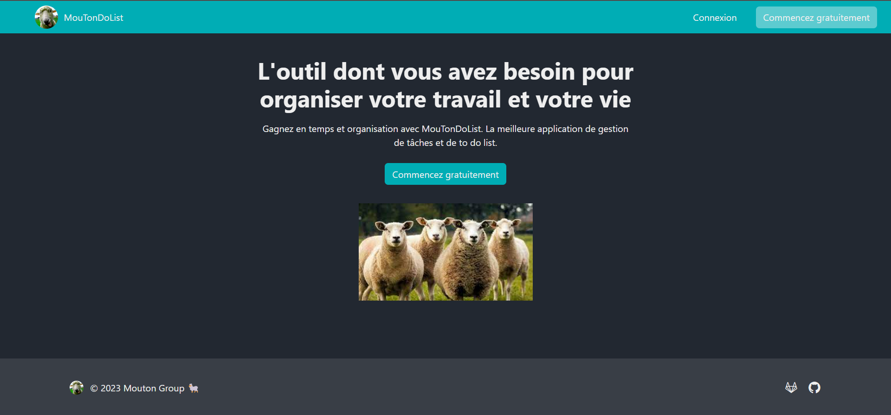

# Projet Todo

## Installation & démarrage

- Copier .env-example à .env puis le remplir
- Copier .phinx-example.yml à phinx.yml puis le remplir
- Executer la commande: `docker-compose up`

### Base de données

La base de données fonctionne avec des migrations.

La commande pour gérer les migrations est : `vendor/bin/phinx migrate`

#### Seeder la base de données (seulement en dev)

**Important:** Il faut que la base de données soit vide avant de lancer la génération de données de test. Sinon il y'aura des incohérances et des duplications dans la base de données.

`vendor/bin/phinx seed:run`

## Fonctionnement général

### Hors connexion

- Page d'accueil : http://localhost:8080/
- Création de compte : http://localhost:8080/account/register
- Connexion : http://localhost:8080/account/login

### Dashboard

- Dashboard : http://localhost:8080/dashboard

#### Projet

- un projet correspond à une to-do-list
- un projet comporte à minima une section, éventuellement plusieurs sections
- un projet peut-être partagé ou archivé

#### Section

- une section peut comporter plusieurs tâches.

#### Tâche

- une tâche peut-être validée
- une tâche peut-être assignée à un utilisateur ou non assignée
- une tâche possède une liste de commentaires (éventuellement vide)

#### Utilisateur

- un utilisateur est membre d'un projet
- un utilisateur peut-être propriétaire ou invité
- un invité a les droits de lecteur ou d'éditeur
- les permissions d'un utilisateur varient donc en fonction de son statut

### API

Notre API couvre toutes les actions de l'application.

Vous pouvez trouver la documentation ici : http://localhost:8080/swagger

## Fonctionnalités

### Hors connexion

- création de compte
- connexion

### Dashboard

- déconnexion
- édition du mot de passe
- changer de thème
- changer de langue

#### Projet

Selon les permissions :
- création (depuis la sidebar)
- duplication
- suppression/quitter
- archivage/désarchivage
- modifier le nom
- masquer les tâches validées
- inviter un utilisateur
- retirer un membre
- changer le rôle d'un membre

#### Section

Selon les permissions :
- créer/supprimer
- déplacer (drag-and-drop)

#### Tâche

Selon les permissions :
- créer
- supprimer
- dupliquer
- valider
- modifier nom, description et membre assigné
- déplacer (drag-and-drop)

#### Autres

Autres fonctionnalités accessibles depuis la barre de navigation :

- lorsqu'un utilisateur est invité à un projet, il peut y répondre depuis le centre des notifications
- lorsqu'un membre est assigné à une tâche, il peut retrouver la liste (par date) de ses affectations
- fonctionnalité de recherche des tâches dans le projet courant : par nom d'utilisateur (suggéré) ou par mots clés

Attention cependant : l'attribution d'une date à une tâche n'est pas encore implémentée au niveau du front, notamment par manque de temps mais aussi car cette fonctionnalité n'est pas obligatoire vis à vis du sujet.

## Documentation fonctionelle

### Code Twig

On retrouve les fichiers twig dans `src/Application/Views`. Le fichier `layout.twig` sert de template général aux autres fichiers.

#### Principaux

Dans `/components` se trouve les éléments principaux qui correspondent aux balises : `head`, `header`, `footer`, `modal`, etc.

#### Home

Dans `/home` se trouve `content.twig` qui reprend le template de base et applique ses propres composants qu'on retrouve dans `/home/components`. Cela représente les pages auxquelles un invité (utilisateur non connecté) aura accès : présentation, connexion, inscription, etc...

#### Pages

Dans `/pages` se trouve `dashboard.twig` qui le template de base et applique ses propres composants qu'on retrouve dans `/pages/components`. Cela représente les éléments auxquelles un utilisateur connecté aura accès : projet, section, tâche, barre verticale, etc...

### Traductions

Dans `/public/assets/translations/` on retrouve des fichiers au format `JSON` qui contiennent chacun les labels de leur langue.

Langues pour l'instant disponibles :
- français (default) => `translations.fr.json`
- english => `translations.en.json`

###  Feuilles de style

- SCSS => `/public/assets/scss/`
- CSS => `/public/assets/css/`

#### Base SCSS

Le fichier princpal est `global.css` et doit être compilé au format CSS. Il s'occupe d'importer bootstrap et de combiner les autres fichiers au format SCSS. Il doit uniquement être modifié si un fichier SCSS doit être ajouté.

#### Couleurs SCSS

Plusieurs fichiers de thèmes existent, avec un nom selon le format suivant : `theme-nom.scss`. Ils sont importés et combinés par `global.scss`. Ces fichiers modifient uniquement les propriétés bootstrap des éléments au niveau des couleurs. Lorsqu'une propriété est ajoutée, elle doit l'être dans chaque fichier `theme-nom.scss`.
Attention : le thème par défaut est une "copie" de `theme-dark.scss` au format CSS (voir [ici](#couleurs-css)).

#### Layout SCSS

C'est le fichier `layout.scss`. Il est importé et combiné par `global.scss`. Il modifie les propriétés bootstrap des éléments au niveau de leur comportement.
Attention : ce fichier est différent du ficher de même nom situé dans `public/assets/css/layout.css` (voir [ici](#layout-css)).

#### Base CSS

On y retrouve la version compilée du fichier SCSS `public/assets/scss/global.scss` (voir [ici](#base-scss)). Ce fichier ne doit pas être modifié et doit être importé comme stylesheet dans le HTML.

#### Couleurs CSS
Les thèmes sont gérés par des fichiers au format SCSS (voir #lien). Cependant, le thème par défaut doit être au format CSS et importé comme stylesheet dans le HTML. On retrouve donc le fichier `theme-default.css` qui reprend les propriétés du fichier `public/assets/scss/theme-dark.scss` (voir [ici](#couleurs-scss)). Ainsi, si `theme-dak.scss` est modifié, il faut procéder manuellement à la modification dans `theme-default.css` (en CSS !).

#### Layout CSS
C’est le fichier `layout.css`. Il doit être importé comme stylesheet dans le HTML. Contrairement au fichier `layout.scss` (voir [ici](#layout-scss)), il modifie les propriétés des nouveaux éléments non pris en charge par bootstrap (comportement et parfois couleurs).

### Javascript

- `actions.js` => exécute les actions front et appels API
- `check-connection.js` => exécute des vérifications à la connexion
- `check-register.js` => exécute des vérifications à la création de compte
- `checks.js` => exécute des vérifications générales avant les exécutions des actions
- `content.js` => récupère une adaptation du code `twig` en `js` pour certains éléments
- `dragdrop-setup.js` => initialise les drag and drop
- `local-storage.js` => gère le local storage
- `modal-init.js` => gère les modals
- `notifications.js` => gère le centre des notifications
- `popover-init.js` => initialise les popovers
- `popover-setup.js` => gère les popovers
- `repositories.js` => gère les appels API
- `search.js` => effectue la recherche (front)
- `sidebar-event.js` => toggle de la sidebar
- `Sortable.min.js` => inclusion de la libraire `Sortable`
- `theme-switcher.js` => effectue le changement de thème
- `translations.js` => effectue le changement de langue
- `utils-data.js` => gère l'objet `data`
